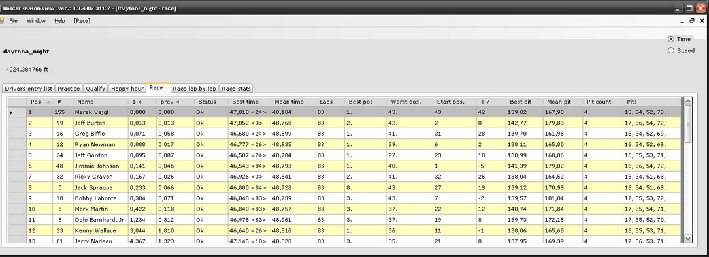
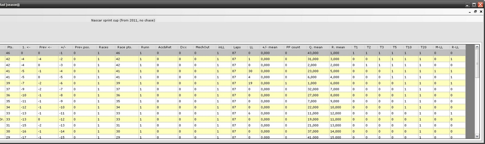

## Project Description
NR2003 season view application is program which consumes telemetry events produced by "Nascar racing 2003" game and represents them in race or season statistics data.

For a NR2003 session, when telemetry data is recorded, can be published:
* for a practice, a rush hour and (when it does make a sence) a qualify:
	* best time
	* 2nd best time
	* 3rd best time
	* gap to previous time
	* gap to first time
	* number of completed laps 
* for a race:
	* number of yellow flags
	* shortest/longest yellow block
	* shortest/longest green block

	* standings (of course)
	* gap to previous time
	* gap to first time
	* starting position
	* fastest time (overview of all laps can be opened)
	* mean lap time
	* number of driven laps
	* number of laps in lead
	* race finish status (retired/accident/...)
	* number of pit laps (overview of all pit times can be opened)
	* fastest pit time
	* mean pit time
	* +/- qualify/finish position

For a season created from the recorded races can be:
* as season settings:
	* choose how drivers will be scored (multiple NR scoring, indy scoring, F1 scoring, ...)

* after each season race:
	* number of points
	* points gap to previous/first driver
	* number of totally completed laps
	* number of laps in lead
	* number of races in lead
and more...

(continue down to section **how does it work** )

Race result example:

Season result example:

## How does it work
NR2003 game cannot simply collect all this information, but there is library which can read telemetry data from running race, like who and when cross finish line, current standings etc. This application collets those data into text telemetry file and process them to the statistics mentioned upper.
To use you need to:
# Start telemetry recorder (.exe application running in background) and insert text file name where captured data are stored
# Start and play NR2003 - when game is quit the telemetry recorder will automatically quit too
# Start NR2003 stats view
# Create race from text file with captured data
# Enjoy race statistics :-)
# For multiple races create season and add created races
# Enjoy season statistics :-)
